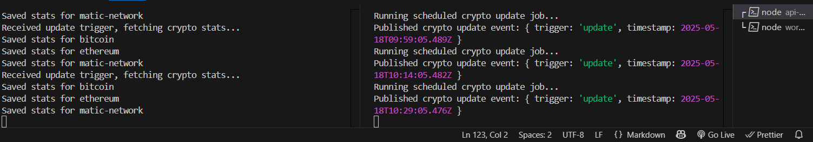
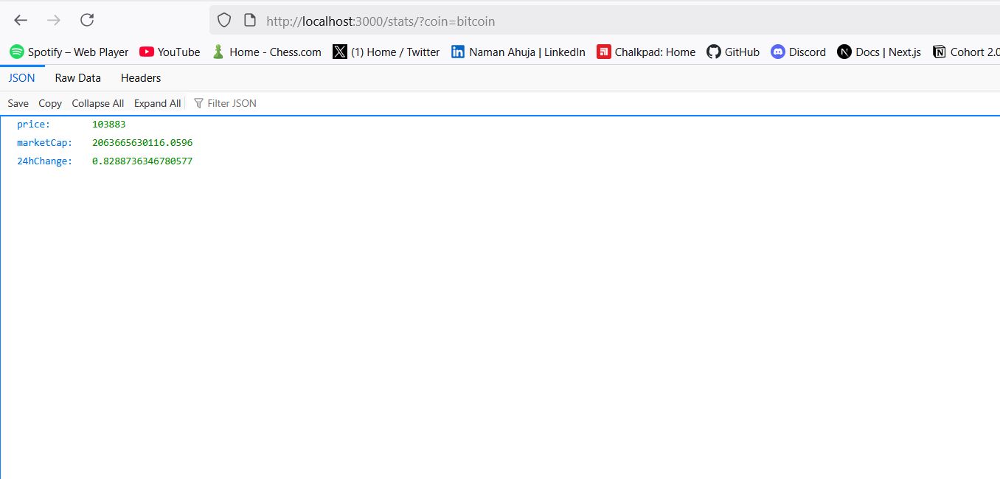
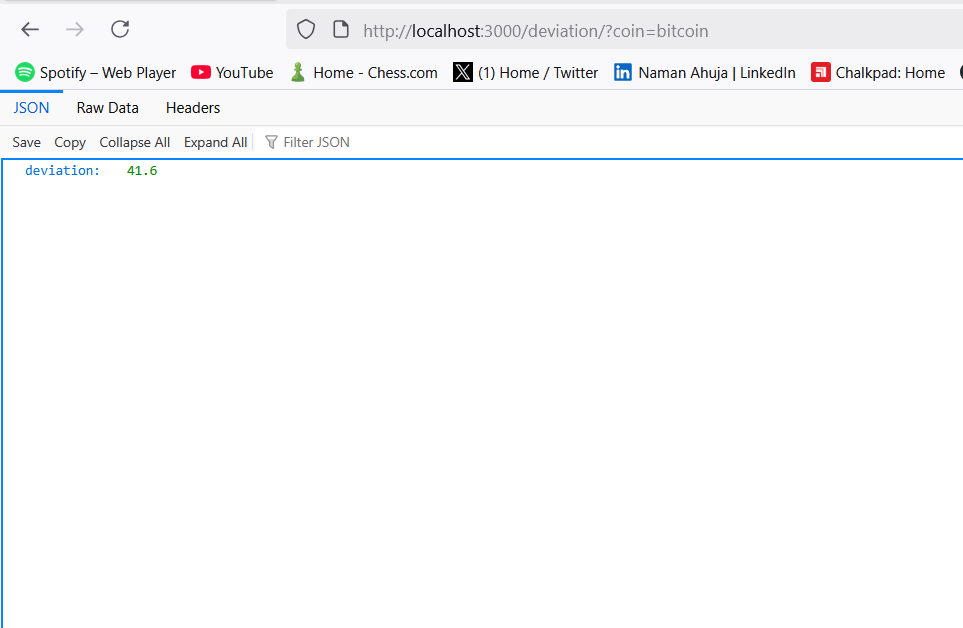

# Cryptocurrency Statistics System

A complete backend system for collecting and exposing cryptocurrency statistics using Node.js, MongoDB, and NATS message queue.

## Architecture

The system consists of two servers:
1. **API Server** (`/api-server`): REST API for cryptocurrency statistics
2. **Worker Server** (`/worker-server`): Background job scheduler



Communication between servers happens via NATS event queue.

## Prerequisites

Before running the application, make sure you have:
- Node.js (v16 or higher)
- MongoDB (local installation or MongoDB Atlas)
- Docker (for running NATS server)

## Quick Start

### 1. Setup NATS Server with Docker

**Pull and run NATS server:**
```bash
# Pull the official NATS Docker image
docker pull nats:latest

# Run NATS server in Docker
docker run -d --name nats-server -p 4222:4222 -p 8222:8222 nats:latest
```

**Verify NATS is running:**
```bash
# Check if the container is running
docker ps | grep nats

# Check NATS server logs
docker logs nats-server
```

**To stop/start NATS server:**
```bash
# Stop NATS
docker stop nats-server

# Start NATS
docker start nats-server

# Remove NATS container (if needed)
docker rm -f nats-server
```

### 2. Setup MongoDB

**Option A: Local MongoDB**
- Install and start MongoDB locally
- Default connection: `mongodb://localhost:27017/crypto_stats`

**Option B: MongoDB Atlas**
- Create a free cluster at https://cloud.mongodb.com
- Get your connection string
- Update `.env` files with your connection string

### 3. Setup API Server

```bash
cd api-server
npm install
cp .env.example .env  # Configure your environment variables
npm start
```

### 4. Setup Worker Server

```bash
cd worker-server
npm install
cp .env.example .env  # Configure your environment variables
npm start
```

## API Endpoints

### GET /stats
Get latest cryptocurrency statistics.

**Query Parameters:**
- `coin`: `bitcoin`, `ethereum`, or `matic-network`

**Example:**
```bash
curl "http://localhost:3000/stats?coin=bitcoin"
```



### GET /deviation
Get standard deviation of price for last 100 records.



**Query Parameters:**
- `coin`: `bitcoin`, `ethereum`, or `matic-network`

**Example:**
```bash
curl "http://localhost:3000/deviation?coin=bitcoin"
```

## How It Works

1. **Worker Server** runs a background job every 15 minutes
2. Publishes an event to NATS queue: `{ "trigger": "update" }`
3. **API Server** listens for these events
4. When event received, API server fetches data from CoinGecko API
5. Data is stored in MongoDB with timestamp
6. REST APIs provide access to stored data and calculations

## Project Structure

```
/
├── api-server/
│   ├── index.js           # Main server file
│   ├── models/
│   │   └── CryptoStat.js  # MongoDB schema
│   ├── package.json
│   ├── .env
│   └── README.md
├── worker-server/
│   ├── index.js           # Background worker
│   ├── package.json
│   ├── .env
│   └── README.md
└── README.md
```

## Features

- ✅ Real-time cryptocurrency data from CoinGecko API
- ✅ Automated data collection every 15 minutes
- ✅ REST API for statistics and deviation calculations
- ✅ Event-driven architecture with NATS
- ✅ MongoDB for persistent storage
- ✅ Proper error handling and logging
- ✅ Clean, minimal code structure

## Environment Variables

### API Server
- `MONGODB_URI`: MongoDB connection string
- `NATS_SERVER`: NATS server URL (default: `nats://localhost:4222`)
- `PORT`: Server port (default: 3000)

### Worker Server
- `NATS_SERVER`: NATS server URL (default: `nats://localhost:4222`)

## Docker Commands Reference

**Useful Docker commands for NATS:**

```bash
# View NATS container logs
docker logs -f nats-server

# Access NATS container shell
docker exec -it nats-server sh

# Check NATS server info (requires nats cli)
docker exec nats-server nats server info

# Restart NATS container
docker restart nats-server
```

## Production Deployment

For production deployment:
1. Use MongoDB Atlas for the database
2. Deploy NATS server using Docker in your cloud infrastructure
3. Use environment variables for all configuration
4. Consider using docker-compose for orchestration
5. Use PM2 for Node.js process management
6. Set up monitoring and logging

**Example docker-compose.yml for production:**
```yaml
version: '3.8'
services:
  nats:
    image: nats:latest
    ports:
      - "4222:4222"
      - "8222:8222"
    restart: unless-stopped
```

## CoinGecko API

**Do you need a CoinGecko API key?**

No, this implementation uses CoinGecko's free public API which doesn't require an API key. The free tier allows:
- 50 calls/minute
- 10,000 calls/month

For higher usage, you can sign up for a paid plan and add your API key to the requests.

## License

MIT